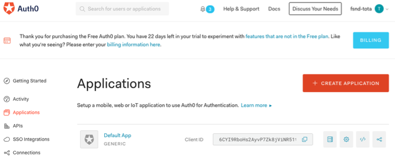
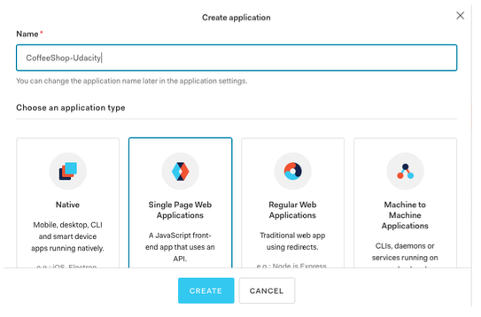
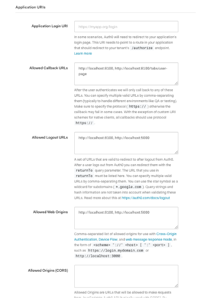
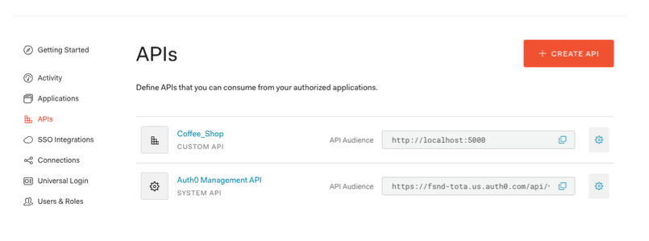
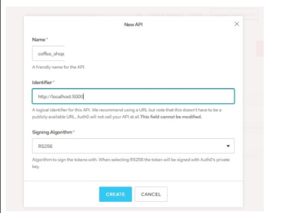
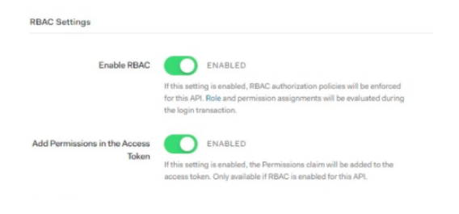
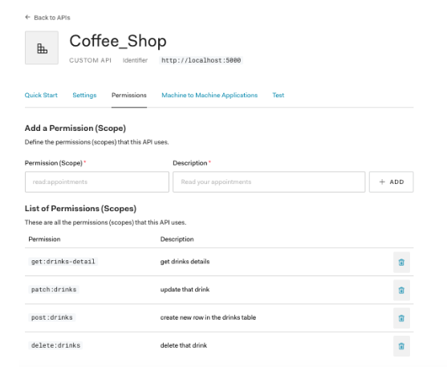
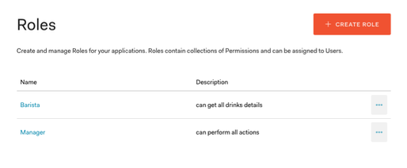
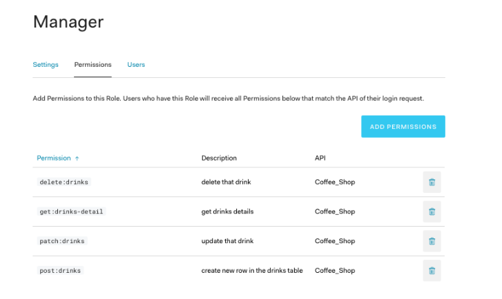
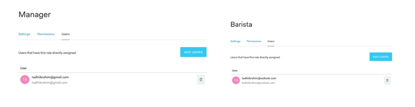

# Dependencies

* [Auth0 account](https://www.auth0.com)

### Step 1 - Log in to your Auth0 account

This is straightforward, simply go to [Auth0 login page](https://auth0.com/auth/login) and access  your account

### Step 2 - Start the `Auth0 application` creation process

From your Auth0's Dashboard, hit the orange button located in the top-right of your screen.

### Step 3 - Select the application type

### Step 4 - Configure your new application

Now you will have to focus in the `Application URIs` section.

> **Attention: the `Application Login URI` field must remain empty and the other fields unchanged**

### Step 5 - Create the API of your application
Through your left-menu you can reach the `APIs` section and click the orange button in the top-right.

### Step 6 - Configure your API - Enable RBAC

This step is necessary to allow this API to carry out permissions within the token. Look for the
 `RBAC Settings` field and enable both options there.
 
 

### Step 7 - Configure your API - Create the permissions

Now go to the `permissions` tab and add the permissions described on the project's guide

* get:drinks-detail	
* post:drinks	
* patch:drinks	
* delete:drinks	

 
 
 
### Step 8 - Create the roles

Through your left-menu you can reach the `roles` section and click the orange button in the top-right.

You will have to create two roles `Barista` & `Manager` there.

### Step 9 - Configure the roles - Assign permissions

After that, click in the `permissions` tab 
and add the required permissions for each role through the blue button `Add permission`. 

The permissions were created in the Step 7. 

